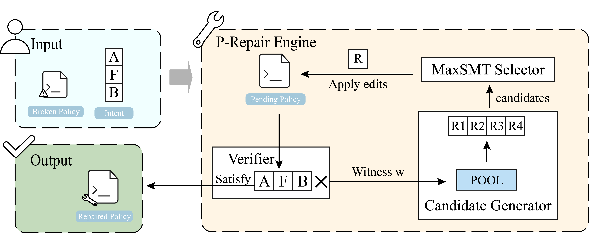

# P-Repair

A prototype tool for least-change repair of cloud access control policies.

## What is P-Repair?



P-Repair is a prototype system for tightening cloud access control policies with respect to an explicit intent specification. It takes as input a set of identity- and resource-based policies together with an intent triple (A, F, B) describing the allowed envelope, forbidden slice, and business baseline. A verifier checks the current policies against this intent; whenever it finds a violating request, P-Repair generates a small pool of “shrink-only” edits and uses a MaxSMT solver to choose a minimum-cost subset within the generated candidate pool, favoring local, structure-preserving changes. Iterating this counterexample-guided loop yields a repaired policy set that preserves required access, blocks forbidden behavior, and stays within the intended envelope.

## Environment

P-Repair is implemented in Python and uses the `z3-solver` package (Z3 Optimize) together with `matplotlib` for plotting. A typical setup uses Python 3.9 or newer, a virtual environment, and:

```bash
pip install z3-solver matplotlib
```

All commands are run from the repository root with the configured Python environment activated.

## Dataset generation

Per-service benchmarks for S3, EC2, RDS, and Lambda are generated by:

```bash
python tools/generate_experiments.py
```

This populates JSON cases under:

- `experiments/s3`
- `experiments/ec2`
- `experiments/rds`
- `experiments/lambda`

Mixed-service synthetic benchmarks for the `statements`, `wildcards`, and `universe` families are created by:

```bash
python tools/generate_perf_mixed.py
```

under:

- `experiments/perf/mixed`

## Experiment reproduction

Once the datasets are generated, the main experiments can be reproduced as follows:

- **RQ1 – Overall correctness and availability**

  ```bash
  python tools/run_rq1_overall.py
  ```

- **RQ2 – Edit breakdown and total edit cost**

  ```bash
  python tools/run_rq2_edits.py
  ```

- **RQ3 – Mixed-service performance (statements / wildcards / universe)**

  ```bash
  python tools/run_perf_mixed.py
  python tools/plot_mixed_dual_axis.py
  ```

- **RQ4 – Ablation study on edit-selection strategies**

  ```bash
  python tools/run_rq4_ablation.py
  ```

- **RQ5 – Authorization-time overhead after repair**

  ```bash
  python tools/run_rq5_authz_overhead.py
  ```

All scripts write their metrics and figures into the `outputs/` directory.

## Tool usage

### Single-case repair via CLI

For ad-hoc inspection and repair of a single benchmark JSON, use:

```bash
python policy_repair_z3_multi_io.py \
  --in  experiments/ec2/case_01.json \
  --out outputs/ec2/case_01_repaired.json
```

The output file contains the repaired policies together with evaluation metrics (for example, whether the repaired set satisfies all intent constraints).

### Running on custom inputs

To run P-Repair on a custom policy and intent specification:

1. Encode the input as a JSON file with the same schema as the benchmarks under `experiments/`.
2. Invoke:

   ```bash
   python policy_repair_z3_multi_io.py --in path/to/your_case.json --out outputs/your_case_repaired.json
   ```

3. Inspect the repaired policy set and metrics in the output JSON.
